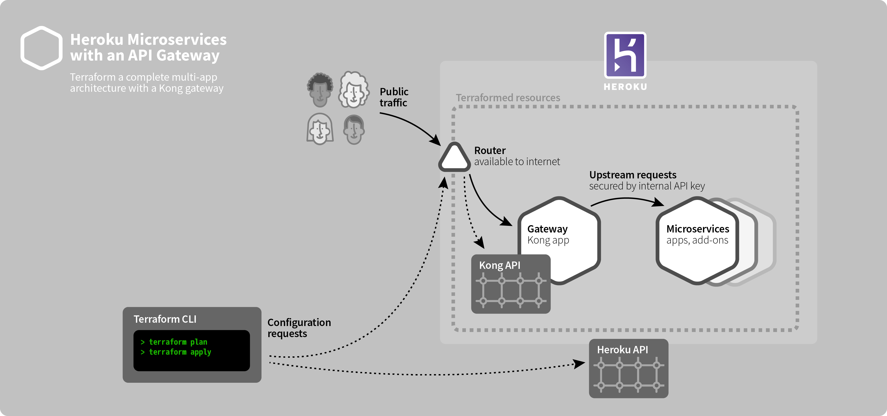

# Heroku Common Runtime microservices with a unified gateway using Terraform

Each microservice is exposed to the internet through a Kong [service](https://docs.konghq.com/0.14.x/admin-api/#service-object) & [route](https://docs.konghq.com/0.14.x/admin-api/#route-object), secured via Heroku's built-in SSL/TLS certificates.

The [Common Runtime](https://devcenter.heroku.com/articles/dyno-runtime#common-runtime) allows public access to web apps by default. To ensure the gateway provides exclusive access to the microservices, the microservices must restrict access using a pre-shared API key (generated by Terraform) set in the "X-Internal-API-Key" HTTP header.

A single [Terraform config](https://www.terraform.io/docs/configuration/index.html) embodies the complete system, enabling high-level collaboration, repeatability, test-ability, and change management.



▶ See also: **[Heroku Enterprise / Private Spaces version of this architecture](https://github.com/heroku-examples/terraform-heroku-enterprise-kong-microservices)**

## Primary components

* [Heroku](https://www.heroku.com/home) provides the primatives: Apps and Add-ons
* [Kong CE on Heroku](https://github.com/heroku/heroku-kong) provides a high-performance HTTP proxy/gateway with [plugins](https://konghq.com/plugins/) supporting access control, flow control, logging, circuit-breaking, and more including custom plugins
* [Terraform](https://terraform.io) provides declarative, unified systems configuration with support for over 120 providers, a human-friendly configuration as code format, and a deterministic provisioning engine

## Challenges & Caveats

* **Config drift when using Heroku Dashboard or CLI.** Once the config is applied, if changes are made to the resources outside of Terraform, such as scaling dynos, setting config vars, changing add-ons, etc, then the Terraform state will no longer match its configuration, making it impossible to apply or destroy further until the drifting values are imported (for new resources) or manually updated in `terraform.tfstate`.
* **Connecting the Terraform config with Heroku slugs.** This proof-of-concept [contains slug archives](slugs/) that were manually extracted with the Heroku API from pre-existing apps. While there's a higher-level conceptual challenge with the design of this interconnection between Heroku DX & Terraform, there are use-cases this proof-of-concept still serves, such as  using Heroku Pipelines purely as a build & QA system ([example](https://github.com/heroku-examples/terraform-heroku-pipeline-slugs)), and with an external CI/build system creating slug archives for Terraform.
* **Renaming Terraform-provisioned Heroku apps.** If apps are renamed, Terraform can no longer access various resources without first manually editing, revising `terraform.tfstate` with the new names. See **terraform-provider-heroku** issues [#124](https://github.com/terraform-providers/terraform-provider-heroku/issues/124) & [#93](https://github.com/terraform-providers/terraform-provider-heroku/issues/93)

## Requirements

* [Heroku](https://www.heroku.com/home)
  * install [command-line tools (CLI)](https://toolbelt.heroku.com)
  * [an account](https://signup.heroku.com)
  * [a team](https://devcenter.heroku.com/articles/heroku-teams)
* install [git](https://git-scm.com/book/en/v2/Getting-Started-Installing-Git)
* install [git-lfs](https://git-lfs.github.com) (efficiently supports checking Heroku app slugs into version control)
* install [Terraform](https://terraform.io)

## Usage

Ensure the [requirements](#user-content-requirements) are met, then,

1. Clone this repo:

    ```bash
    git clone git@github.com:heroku-examples/terraform-heroku-common-kong-microservices.git
    cd terraform-heroku-common-kong-microservices/
    ```
2. Install [terraform-provider-kong 1.9.1](https://github.com/kevholditch/terraform-provider-kong/releases/tag/v1.9.1)
    * download the `.zip` asset for your computer's architecture
    * unzip it into `terraform.d/plugins/$ARCH/`
    * where `$ARCH` is the computer's architecture, like `darwin_amd64`
3. Set Heroku API key
    1. `heroku authorizations:create -d terraform-heroku-common-kong-microservices`
    2. `export HEROKU_API_KEY=<"Token" value from the authorization>`
5. `terraform init`
6. Then, apply the config with your own top-level config values:

    ```bash
    terraform apply -var name=kong-micro -var heroku_team=my-team
    ```
7. Visit the output URLs in a web browser to demonstrate the secure backend & public gateway:
    - ❌ `terraform output wasabi_backend_url` not directly accessible
    - ✅ `terraform output wasabi_public_url`

-----

🔬 This is a community proof-of-concept, [MIT license](LICENSE), provided "as is", without warranty of any kind.
